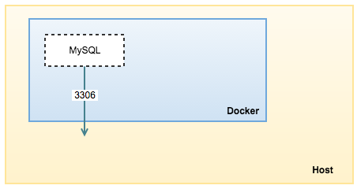
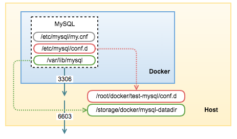

# Labo 3

<small>
Jean-Thomas Baillargeon</small>  
<small>GLO-2005 </small>  

---

## Télécharger VS CODE!

---

## Retour Labo 2
* Succès mitigé à réaliser la question 5.1
    *   C'est ok :)
* Rappel d'utilisation de docker et du Client MySQL

---

## Agenda
* Faire la fameuse question 5.1 
* Mise en place de VSCode
* Sauvegarder sa BD avec docker
* Faire une question du genre Ch. 8. du livre avec les carrés

---

## Question 5.1
* Étape 1: Lire le problème
* Étape 2: Quelles sont les valeurs / tables impliquées
* Étape 3: Comment se rendre du point A au point B
* Étape 4: Décortiquer morceau par morceau
* Étape 5: Lancer la commande 

---

## Mise en place VS-Code
* Étape 1: Télécharger VS Code
* Étape 2: Se créer un workspace (facultatif, mais pertinent)
* Étape 3: Connectecter Docker (pour Windows seulement)
* Étape 4: Créer le raccourci clavier le plus utile au monde

---

## Sauvegarder sa BD
* Étape 1: Instancier un conteneur avec l'option -V
* Étape 2: [...]
* Étape 3: [...]

---

## Conteneur sans option -V

---

## Conteneur avec option -V

---

## Sauvegarder sa BD
* Étape 1: Instancier un conteneur avec l'option -V
* Étape 2: Business as usual
* Étape 3: Lors du redémarrage la BD sera encore là

---

## Question Type Ch.8 
* Trouver les cours enseignés par les professeurs qui ont des noms de famille qui sont des prénoms
* Étape 1: Se créer un fichier de script SQL
* Étape 2: Déterminer les variables
* Étape 3: Coder le tout!

